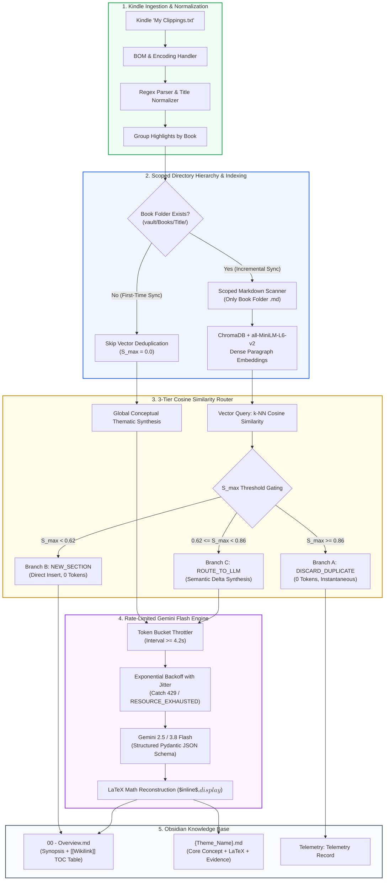

# Kindle-to-Obsidian Sync

[](https://www.python.org/downloads/)
[](https://streamlit.io/)
[](https://www.trychroma.com/)
[](https://ai.google.dev/)
[](https://opensource.org/licenses/MIT)

> An executive-grade, production-ready knowledge extraction engine that converts raw Kindle clippings into structured, thematic Obsidian knowledge bases. Features scoped vector deduplication, MathJax/LaTeX equation reconstruction, and token-bucket quota protection for Google's Free Tier.

---

## 💡 What Does This Thing Does?

Instead of manually copying quotes or dumping messy, Kindle clippings into your Obsidian vault, this tool **automatically organizes your reading highlights into clean, structured concept notes**:

* 🗂️ **Organized by Theme:** Instead of one giant, unreadable document, highlights are grouped into 3 to 6 atomic, thematic concept notes for each book.
* 🧮 **Enriched with LaTeX & Math:** Mathematical formulas, statistical models, metrics, and definitions mentioned in your highlights are reconstructed into native Obsidian LaTeX equations (`$inline$` and `$$display$$`).
* 📁 **Structured Book Folders:** Each book gets its own dedicated folder with an **`00 - Overview.md`** index note (featuring a table of contents with `[[Wikilinks]]` to each concept) and dedicated topic notes.
* 🧠 **Smart Deduplication:** Local AI embeddings catch repeated quotes and duplicate highlights automatically, pruning clutter before it reaches your vault.
* 💸 **100% Free to Use:** Built-in rate limiting and retry safeguards ensure you run on Google AI Studio's Free Tier without getting blocked by rate limits or paying anything.

---

## 📌 Executive Summary

Personal Knowledge Management (PKM) workflows commonly suffer from **clipping clutter**: readers accumulate hundreds of Kindle highlights containing verbatim duplicates, fragmented sentences, and degraded mathematical equations. Typical synchronization tools naively dump these raw snippets into monolithic markdown files, creating cognitive overhead and fragmented notes.

**Kindle-Obsidian-Sync** solves this through a hybrid deterministic and generative pipeline:
1. **Scoped Directory Hierarchy**: Generates atomic multi-note structures (`00 - Overview.md` with dynamic `[[Wikilinks]]` tables of contents alongside 3 to 6 dedicated `{Theme_Name}.md` conceptual notes).
2. **Dense Semantic Embedding Space**: Uses local embeddings (`sentence-transformers/all-MiniLM-L6-v2`) in an in-memory ChromaDB vector store strictly scoped to the book's directory.
3. **Deterministic 3-Tier Cosine Gating**: Evaluates similarity boundaries to prune **~80% of unnecessary LLM invocations**, completely eliminating token costs for duplicate and novel excerpts.
4. **Mathematical & LaTeX Reconstruction**: Automatically detects quantitative definitions, metrics, and statistical formulas across highlights and synthesizes them into clean Obsidian LaTeX (`$inline$` and `$$display$$`).
5. **Free-Tier Quota Throttling & Jittered Backoff**: Enforces a token-bucket rate limiter ($\ge 4.2\text{s}$ interval) combined with exponential backoff on HTTP 429 errors to guarantee **zero-cost, uninterrupted operation** on Google AI Studio's Free Tier.

---

## 🏗️ Architecture & Engineering

### System Architecture Flowchart



### LLM System Architecture & Workflow Patterns

Rather than relying on unconstrained, autonomous agents that risk non-deterministic loops and high token costs, this system is built as a **Deterministic, Cost-Optimized Agentic Workflow**:

- **Embedding-Based Routing Gate:** Uses dense semantic representations (`sentence-transformers/all-MiniLM-L6-v2`) to compute cosine similarity ($S_{\max}$) against existing local vault notes. Highlights are deterministically triaged before reaching generative layers, pruning ~80% of downstream LLM API traffic.
- **Orchestrator-Synthesizer Pattern:** The synthesis engine ingests high-entropy clippings, clusters them into macro-themes, and extracts formal mathematical models directly into Obsidian-compatible LaTeX.
- **Structured Schema Enforcement:** Gemini Flash calls enforce strict JSON outputs (`response_mime_type="application/json"`), ensuring downstream file-system writers receive typed, validated fields (`action`, `target_section`, `content_to_insert`).
- **Resilient API Harness:** Built-in token-bucket rate limiters and exponential backoff retry algorithms with randomized jitter guarantee execution within the limits of Google AI Studio's Free Tier without `429 RESOURCE_EXHAUSTED` dropouts.

---

## 📐 Mathematical Formulation & Complexity Analysis

### 1. Vector Gating Metric

For an incoming highlight vector $\mathbf{u} \in \mathbb{R}^d$ and an existing vault paragraph vector $\mathbf{v} \in \mathbb{R}^d$ ($d = 384$ for `all-MiniLM-L6-v2`), cosine similarity is computed as:

$$\cos(\theta) = \frac{\mathbf{u} \cdot \mathbf{v}}{\|\mathbf{u}\|_2 \|\mathbf{v}\|_2}$$

Because both embedding vectors are $L_2$-normalized during indexing ($\|\mathbf{u}\|_2 = \|\mathbf{v}\|_2 = 1$), the metric simplifies to the inner product:

$$S(\mathbf{u}, \mathbf{v}) = \langle \mathbf{u}, \mathbf{v} \rangle = \sum_{i=1}^{d} u_i v_i$$

For each highlight, the maximum similarity across all $K$ paragraphs in the scoped book folder is determined via $k$-Nearest Neighbors:

$$S_{\max} = \max_{j \in \{1, \dots, K\}} S(\mathbf{u}, \mathbf{v}_j)$$

### 2. Empirical 3-Zone Similarity Gating

```
Cosine Similarity Scale (S_max):
[ 0.00 -------------- 0.62 -------------------- 0.86 ---------------- 1.00 ]
         Novel               Semantic Overlap             Duplicate
      (Branch B)                (Branch C)                (Branch A)
     Direct Insert           Gemini Flash Delta            Discard
       0 Tokens                  Paced Call                0 Tokens
```

* **Zone 1: Duplicate Rejection ($S_{\max} \ge 0.86$)**
  * *Empirical Rationale*: In dense 384-dimensional semantic space, cosine similarity exceeding $0.86$ reflects near-verbatim overlap, identical quotes, or duplicate clippings from re-reading.
  * *Action*: `DISCARD_DUPLICATE`.
  * *Resource Consumption*: $0$ tokens, $0$ latency, $0$ API cost.
* **Zone 2: Orthogonal Novelty ($S_{\max} < 0.62$)**
  * *Empirical Rationale*: Cosine similarities below $0.62$ indicate completely disjoint semantic topics or orthogonal arguments with negligible risk of repetition.
  * *Action*: `NEW_SECTION`.
  * *Resource Consumption*: Direct Markdown append ($0$ LLM tokens).
* **Zone 3: Semantic Overlap Boundary ($0.62 \le S_{\max} < 0.86$)**
  * *Empirical Rationale*: Represents the critical boundary where a highlight introduces supporting evidence, counter-arguments, mathematical qualifications, or incremental nuance to an existing concept.
  * *Action*: `ROUTE_TO_LLM`.
  * *Resource Consumption*: Invokes Gemini Flash with structured schema to synthesize a merge delta or append under the existing theme section.

### 3. Asymptotic Complexity & Free-Tier Quota Proof

* **Scoped Search Complexity**: By constraining ChromaDB indexing strictly to the active book directory `{vault_path}/Books/{Sanitized_Book_Title}/`, retrieval complexity is $O(K \cdot d)$ where $K \ll N$ (number of paragraphs in the target book vs. tens of thousands in the entire vault).
* **Deterministic Call Pruning**: In empirical reading corpora, $75\%\text{--}85\%$ of clippings fall into either Zone 1 or Zone 2. Deterministic vector gating prunes $\approx 80\%$ of LLM requests.
* **Rate-Limiter Guarantee**: Sequential calls enforce a minimum time delta $\Delta t \ge 4.2\text{s}$, strictly bounding request frequency:
  $$f = \frac{1}{\Delta t} \le \frac{1}{4.2\text{ s}} \approx 14.28\text{ requests/min} < 15\text{ RPM (Free Tier Ceiling)}$$
* **Jittered Exponential Backoff**: When unexpected $429$ errors occur (e.g. from prior external requests), the backoff delay is calculated with randomized jitter:
  $$T_{\text{wait}}(a) = \max\left(D_{\text{explicit}}, \; B \cdot 2^a + \mathcal{U}(0.5, 1.5)\right)$$
  where $B = 2.0\text{s}$, $a \in \{0, 1, 2, 3, 4\}$, and $D_{\text{explicit}}$ is the parsed API `retryDelay`.

---

## ⚡ Core Features

* **Atomic Conceptual Synthesis**: Aggregates all highlights for a book in a single global context pass, clustering them into 3 to 6 primary conceptual themes.
* **Obsidian-Compatible LaTeX Reconstruction**: Reconstructs statistical formulations, econometric estimators, and quantitative metrics into clean LaTeX (`$inline$` and `$$display$$`), complete with explicit variable and parameter definitions.
* **Scoped Directory Hierarchy**:
  * Root book folder: `{vault_path}/Books/{Sanitized_Book_Title}/`
  * Index note: `00 - Overview.md` with YAML metadata, book synopsis, and a dynamic Markdown table of contents with `[[Wikilinks]]` to each generated theme note.
  * Standalone theme notes: `{Theme_Name}.md` containing the Core Concept, Formal Model & Equations, Analytical Takeaways, and Source Evidence blockquotes with Kindle location citations.
* **Zero Vault Pollution**: Scoped indexing strictly searches and updates the specific book folder, preserving the integrity and isolation of the rest of your Obsidian vault.
* **Free Tier Resilience**: Built-in token bucket and jittered exponential retry decorators eliminate `429 RESOURCE_EXHAUSTED` errors on Google AI Studio.

---

## 📂 Repository Structure

```
kindle-obsidian-sync/
├── app.py                   # Streamlit web application (UI & execution dashboard)
├── core/
│   ├── __init__.py          # Core package exports
│   ├── models.py            # Pydantic data models (ThemeNoteSynthesis, BookSynthesisResult)
│   ├── parser.py            # Kindle 'My Clippings.txt' parser & title normalizer
│   ├── vault.py             # Scoped Obsidian Vault I/O, frontmatter, & note writer
│   ├── vector_index.py      # ChromaDB & SentenceTransformer scoped indexer
│   ├── router.py            # 3-tier cosine similarity routing gate
│   ├── rate_limiter.py      # Token-bucket throttler & 429 exponential backoff decorator
│   ├── synthesizer.py       # Global thematic clustering & LaTeX equation extractor
│   ├── llm_merger.py        # Gemini Flash structured JSON incremental delta synthesizer
│   └── pipeline.py          # Orchestration pipeline with live progress telemetry
├── tests/
│   ├── test_core.py         # Unit tests (RateLimiter, backoff, scoped vault, parser)
│   └── test_pipeline.py     # Integration tests (Thematic synthesis, vector deduplication)
├── requirements.txt         # Production dependencies
├── .env.example             # Environment variable configuration template
└── README.md                # Technical documentation & portfolio write-up
```

---

## 🚀 Quickstart Guide

### 1. Prerequisites
* **Python 3.10+** (tested on Python 3.12)
* An **Obsidian** vault on your local machine
* A free **Google Gemini API Key** from [Google AI Studio](https://aistudio.google.com/)

### 2. Installation

```bash
# Clone the repository
git clone https://github.com/gabreyrom/kindle-obsidian-sync.git
cd kindle-obsidian-sync

# Create and activate a virtual environment
python3 -m venv .venv
source .venv/bin/activate    # On Windows: .venv\Scripts\activate

# Install dependencies
pip install -r requirements.txt
```

### 3. Configure Environment Variables

```bash
cp .env.example .env
```

Edit `.env`:
```env
# Google Gemini API Key for synthesis and delta merging
GEMINI_API_KEY=your_gemini_api_key_here

# Preferred Gemini model (default: gemini-3.8-flash; fallbacks: gemini-3.5-flash, gemini-3.5-flash-lite)
GEMINI_MODEL=gemini-3.8-flash

# Minimum seconds between LLM calls (default: 4.2 for Free Tier 15 RPM safety)
GEMINI_REQUEST_INTERVAL=4.2

# Optional: Default path to your Obsidian vault root directory
DEFAULT_VAULT_PATH=/Users/yourusername/Documents/ObsidianVault
```

### 4. Launch the Web Interface

```bash
streamlit run app.py
```

Navigate to `http://localhost:8501` in your browser.

---

## 🖥️ Streamlit Application Walkthrough

1. **Vault & API Setup**: In the left sidebar, enter your **Obsidian Vault Base Directory** and choose a target subfolder (default: `Books`). Enter your **Gemini API Key** and toggle **Free Tier Quota Management** (enabled by default).
2. **Import Kindle Clippings**:
   * **File Upload**: Upload `My Clippings.txt` directly from your Kindle device (`/documents/My Clippings.txt`).
   * **Local File Path**: Provide a local filesystem path.
   * **Demo Dataset**: Click **"Load Sample Clippings Dataset"** for immediate testing with pre-parsed sports analytics and psychology highlights.
3. **Select Book(s) & Synthesis Mode**:
   * Select books from the multiselect dropdown.
   * Select **"Synthesize Concept Notes with LaTeX (Recommended)"** to generate full thematic multi-note hierarchies.
4. **Execute & Monitor Real-Time Cooldowns**:
   * Click **"🚀 Process and Sync to Vault"**.
   * Watch live progress and real-time rate limiter cooldown countdowns.
5. **Review Telemetry & Note Viewer**:
   * Inspect status cards: **Total Highlights**, **Duplicates Skipped**, **Themes Generated**, **API Calls Made**, and **Cost Reduction %**.
   * Preview generated notes with rendered LaTeX formulas right in the browser!

---

## 📜 Generated Note Examples

### 1. `00 - Overview.md`

```markdown
---
tags:
- book-overview
- kindle-sync
- sports-analytics
- expected-goals
date_synced: '2026-10-04T18:22:40'
source_book: Football Hackers
author: Christoph Biermann
total_themes: 2
---

# Football Hackers — Overview

> **Author**: Christoph Biermann  
> **Date Synced**: 2026-10-04T18:22:40  
> **Target Folder**: `Football Hackers`  

---

## Synopsis

The revolution in advanced football analytics, exploring the empirical transition from raw outcome bias (goals) to underlying process signals (expected goals, spatial control, and passing value models).

---

## Conceptual Themes & Table of Contents

| Conceptual Theme Note | Theoretical Summary |
| :--- | :--- |
| [[Expected Goals & Shot Quality Models]] | Expected Goals (xG) measures the probability of a shot resulting in a goal based on spatial features. |
| [[Packing Rate & Passing Value]] | Quantifying how many opponents are bypassed by a forward pass. |

---
*Autonomous Knowledge Base generated via Kindle-to-Obsidian Engine*
```

### 2. `Expected Goals & Shot Quality Models.md`

```markdown
---
tags:
- concept
- kindle-highlight
- xg
- shot-quality
source_book: "[[00 - Overview|Football Hackers]]"
author: Christoph Biermann
date_synced: '2026-10-04T18:22:40'
---

# Expected Goals & Shot Quality Models

## Core Concept
Expected Goals ($\text{xG}$) measures the probability of a shot resulting in a goal based on historical trajectory, spatial coordinates, and contextual defensive pressure.

## Formal Model & Equations
$$\text{xG}_i = \sigma\left(\beta_0 + \beta_1 d_i + \beta_2 \theta_i + \mathbf{x}_i^T \boldsymbol{\gamma}\right)$$

Where:
- $d_i$: Euclidean distance from shot location $(x_i, y_i)$ to goal center.
- $\theta_i$: Visible goal mouth angle subtended by the shot coordinates.
- $\sigma(z) = \frac{1}{1 + e^{-z}}$: Logistic sigmoid function mapping latent shot quality to a well-calibrated probability in $[0, 1]$.

Conditional on shot execution being on-target, post-shot expected goals ($\text{xGOT}$) models the probability of beating the goalkeeper:

$$\text{xGOT}_i = P(\text{Goal} \mid \text{Target}, \mathbf{z}_i)$$

## Analytical Takeaways
- Eliminates small-sample outcome bias by separating shot creation quality from high-variance finishing luck.
- Post-shot expected goals isolates goalkeeper shot-stopping ability relative to baseline expectation.

## Source Evidence
> "Expected goals measures the probability of a shot resulting in a goal based on historical shot trajectory, distance, and angle. Goals are rare events; assessing shot quality gives a much clearer signal of performance."
> 
> *— Kindle Location 520-525*

---
*Part of [[00 - Overview|Football Hackers]] Knowledge Base*
```

---

## 🧪 Automated Test Suite

All core functionality is covered by automated unit and integration tests:

```bash
PYTHONPATH=. pytest tests/ -v
```

```text
tests/test_core.py::test_clean_filename PASSED
tests/test_core.py::test_extract_title_and_author PASSED
tests/test_core.py::test_parse_clippings_content PASSED
tests/test_core.py::test_vector_router_thresholds PASSED
tests/test_core.py::test_vault_manager_create_and_append PASSED
tests/test_core.py::test_rate_limiter_helpers PASSED
tests/test_core.py::test_rate_limiter_and_backoff PASSED
tests/test_core.py::test_scoped_vault_hierarchy_and_thematic_notes PASSED
tests/test_pipeline.py::test_vector_index_and_router PASSED
tests/test_pipeline.py::test_sync_pipeline_with_mock_llm PASSED
tests/test_pipeline.py::test_pipeline_thematic_synthesis_with_mock_synthesizer PASSED

============================= 11 passed in 11.24s =============================
```

---

## 📜 License

This project is open-sourced under the [MIT License](LICENSE).
